# Hosting a Static Website in Amazon S3  

Learn how to host and deploy a static website using Amazon S3.  

---

## Overview  
Exploring how to create an S3 bucket, configure access settings, upload static files (HTML, CSS, JS), and enable static website hosting. I also practiced using ACLs, bucket policies, and versioning to understand how permissions and updates work in S3.

---

## Steps I Followed  

### Bucket Creation  
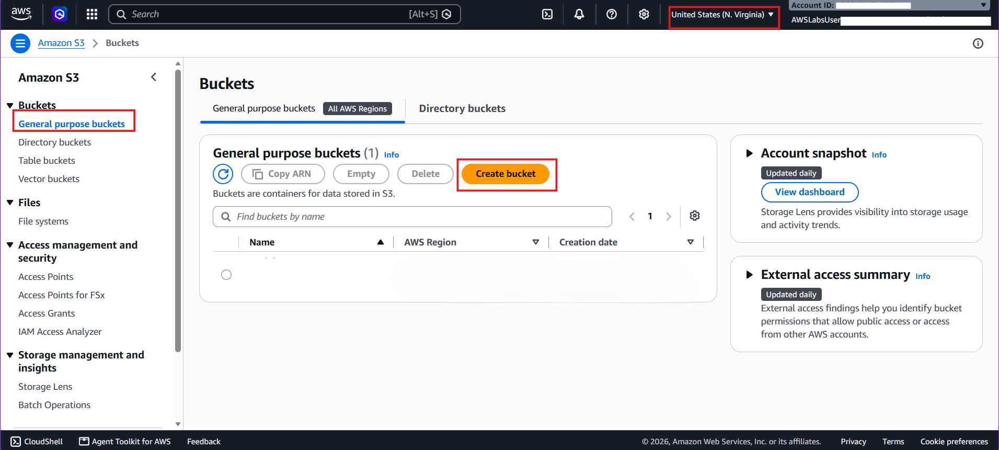

I started by creating an S3 bucket named `aws-hostweb-project`. Bucket names must be unique across all AWS accounts, so no two buckets can have the same name. I chose the region `us-east-1` because picking the closest region helps reduce delay (latency) and cost.

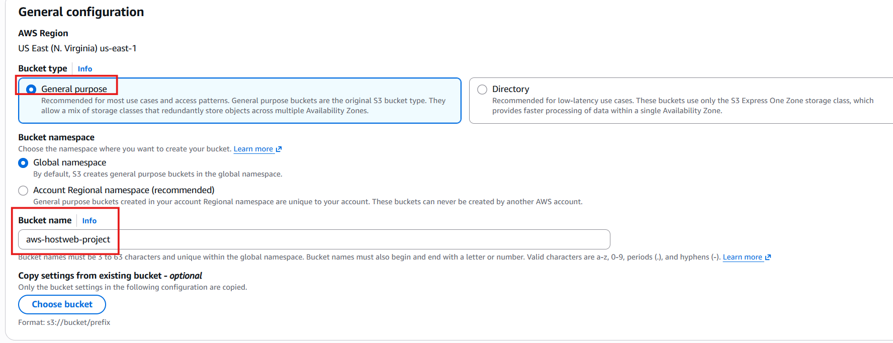

### Object Ownership  
I enabled **ACLs** (Access Control Lists) to see how permissions work, even though AWS recommends turning them off. ACLs are rules that decide who can access files inside the bucket.
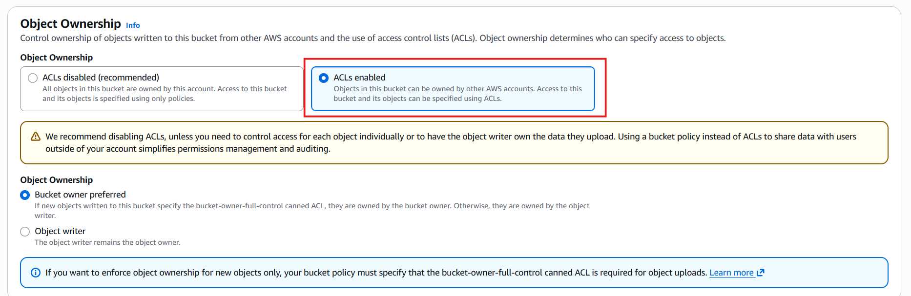

Under Object Ownership, I kept the default setting “Bucket owner preferred” which means the bucket owner is the one who owns uploaded files.  

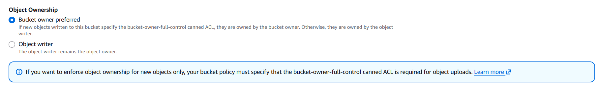

### Disabling the “Block All Public Access”  
Next, I turned off the “Block all public access” option so the website could be viewed by anyone. This setting normally protects the bucket from unwanted access, but for hosting a public site, it needs to be disabled. 

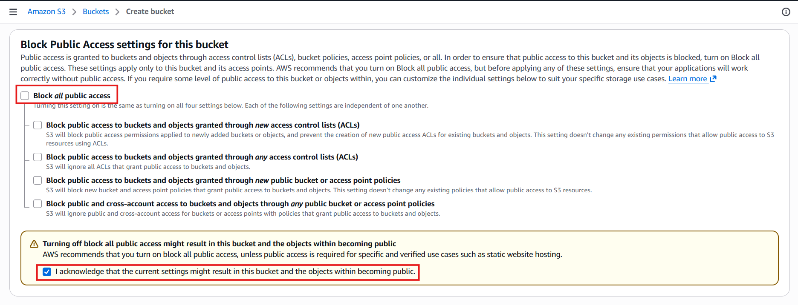

I also enabled bucket versioning to keep track of file changes and left the default encryption on so files are protected. 
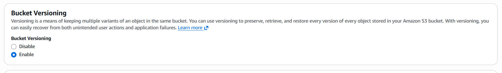

AWS automatically encrypts the objects inside the bucket so whenever someone tries an unauthorize access, they cannot actually view the objects.
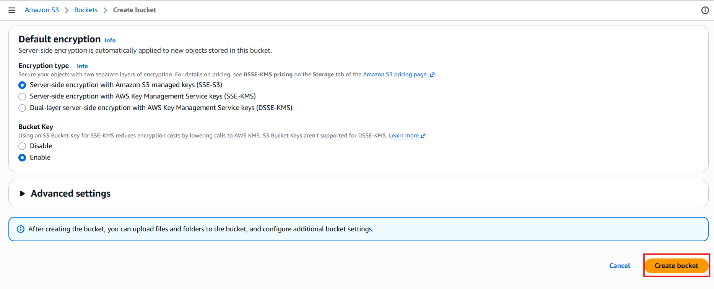

After these settings, the bucket was created successfully and can be seen on the Buckets list.
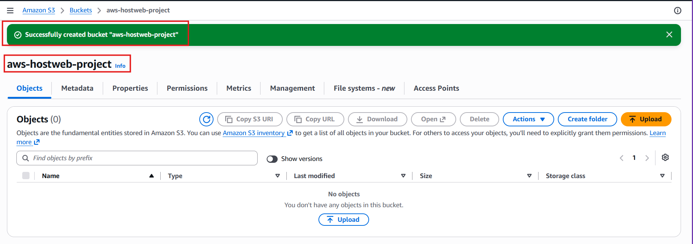
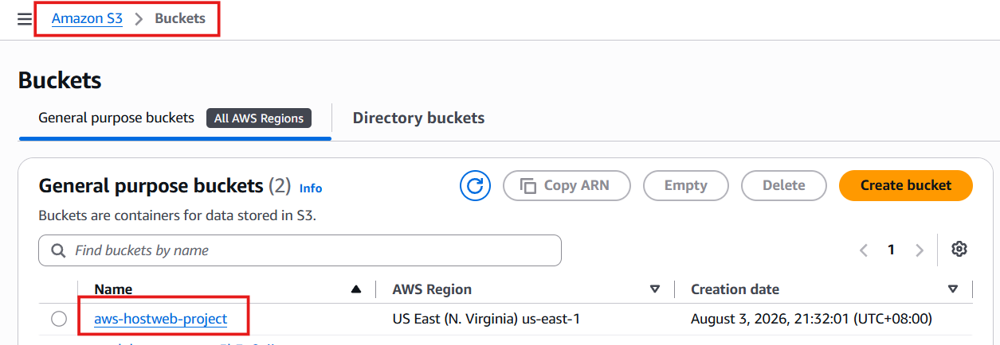

### Uploading Files / Folders
In the created bucket, `aws-hostweb-project`, navigate to Objects tab and click Upload.
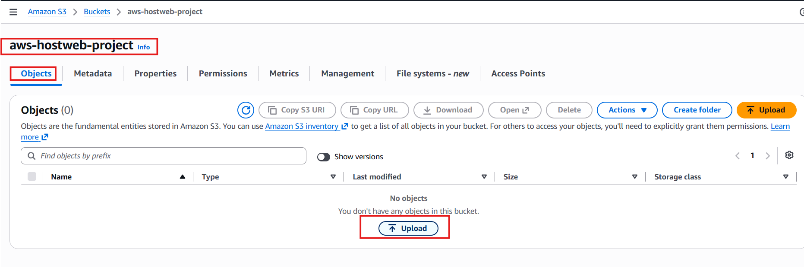
Then click 'Add files'.
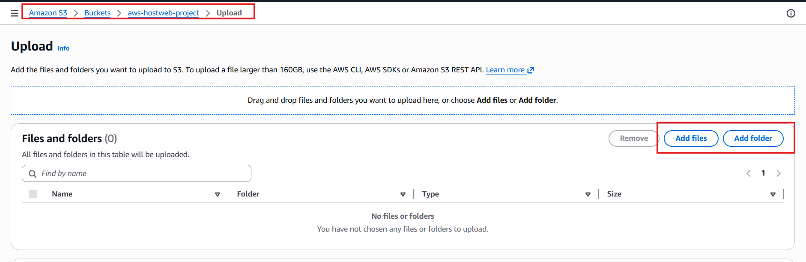

I selected my website files: `portfolio_website.html` and the assets folder containing CSS, JS, and images from my local directory. 
Click the `Upload` button once finished selecting the files.

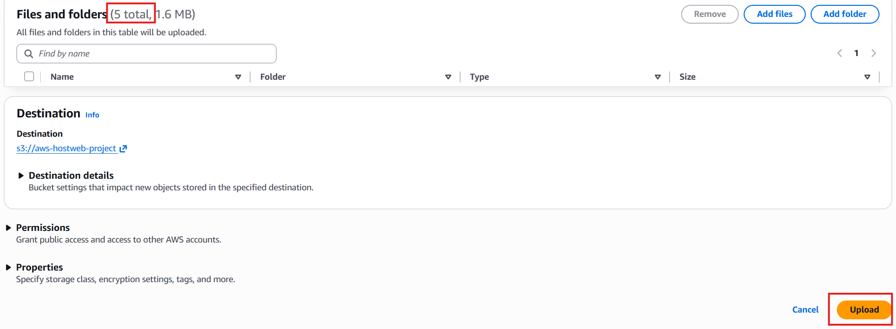

The HTML file gives the structure of the site, while the assets add style and interactivity.

There will be a progress bar for when the uploading is finished.
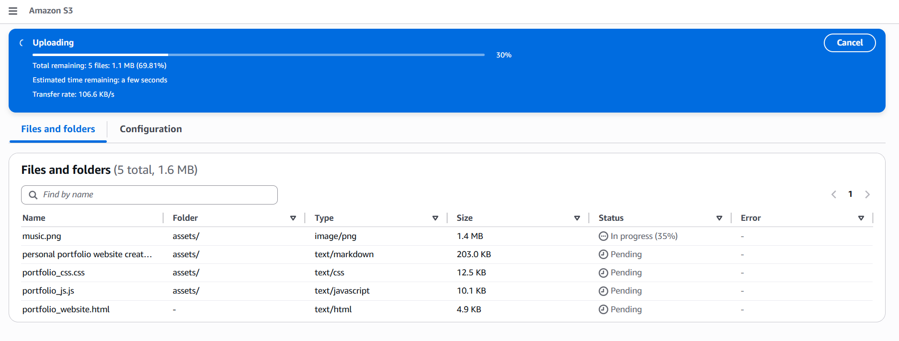

### Access Control List
After uploading, I made the files public using ACLs. Aside from the option earlier to “Block All Public Access” which allows or block public access to the bucket, S3 has this separate security feature: Access Control List that defines which files will be made accessible to the public.

To do this, click the `aws-hostweb-project` bucket. On Objects tab, I selected the necessary files for my static website

Under `Actions` button, select `Make public using ACL `
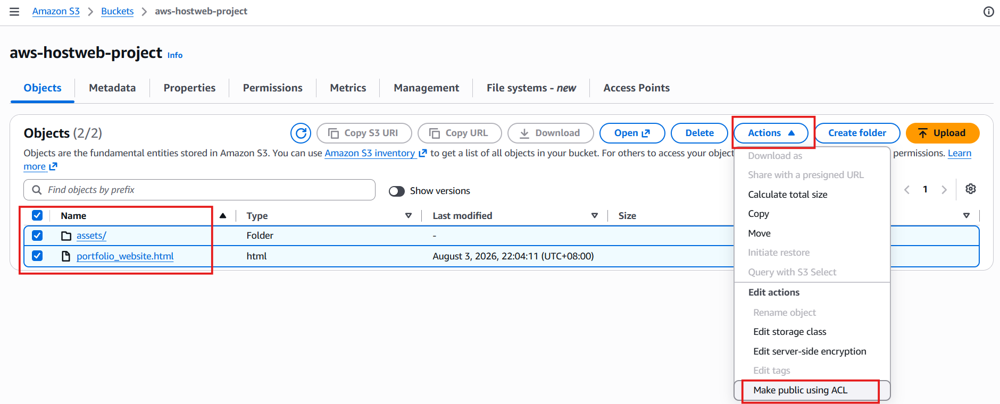
Then click `Make Public`

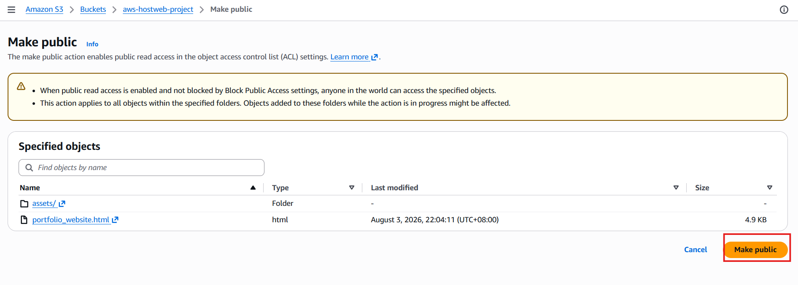

Failing to do this step will eventually result to 403 forbidden error when trying to access the website after it is hosted. 403 means the server denies the access to the web page which in this case, failing to make the objects for public access.

### Static Website Hosting
To make the website available online, I enabled **static website hosting** in the bucket’s properties. 
This setting is Disabled by Default.

Click `Edit`
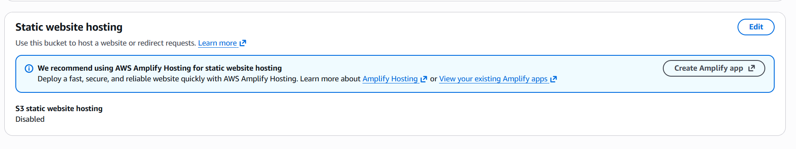

On the Static Website Hosting setting, click Enable and set `Hosting Type` to `Host a Static Website`
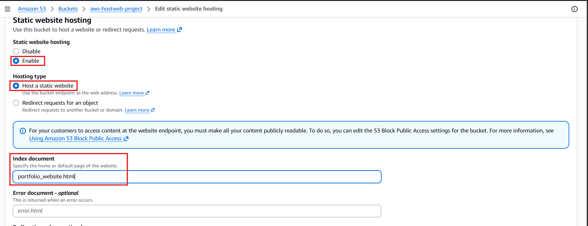

I set `portfolio_website.html` as the index document, saved the changes, and confirmed that the site was accessible through the bucket’s endpoint URL.  
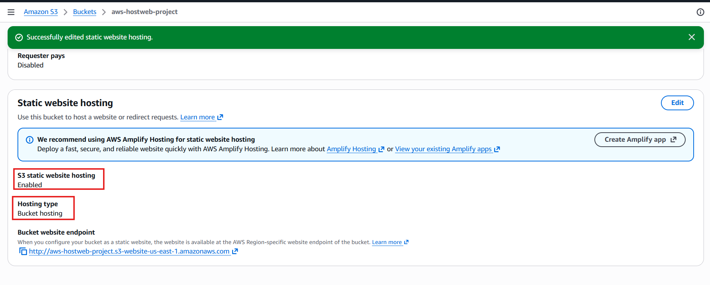

Accessing the website on the browser:
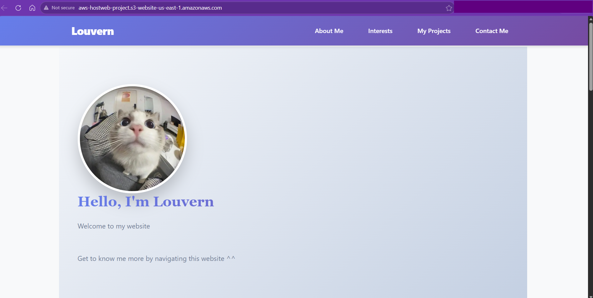


## 🔧 Additional Activities

### 1. Updating files inside the bucket
While testing, I noticed the “My Projects” section was missing.
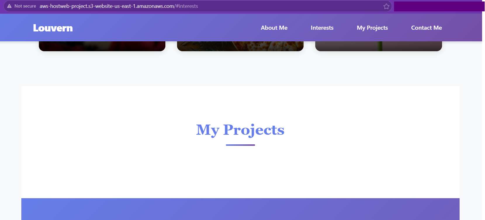

I checked my local HTML, CSS and JS files and I found that the JavaScript file path was not properly reference in my HTML file as I recently changed the folder name into /assets, so I updated the HTML to:  

```html
<script src="./assets/portfolio_js.js"></script>
```
To update an object inside a bucket, click on the "Upload" button and choose the updated file with the same key (name) as the existing object.
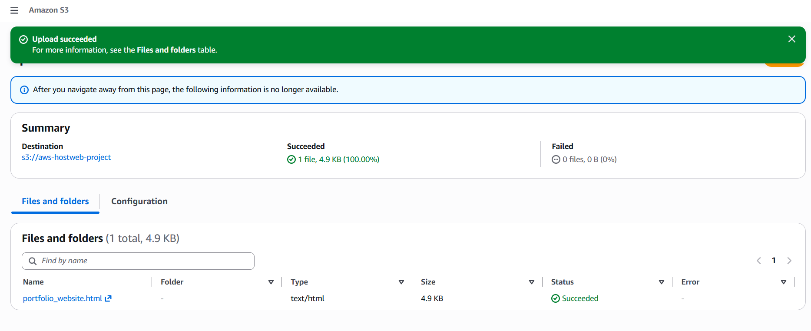

Confirm the upload. This will overwrite the existing object with the new content. I also checked that there are now two Versions of `portfolio_website.html` after updating this HTML file.
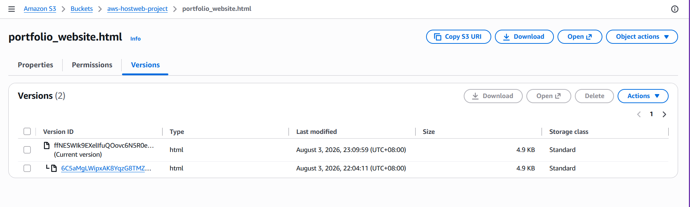


I visited the website URL and welcomed with a 403 error. 
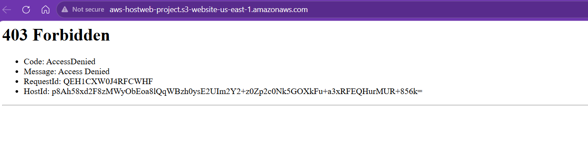
I learned that an updated file also needs to be "Make public using ACLs" again.

After making the updated HTML file public using ACL, the missing section is now visible on the hosted site
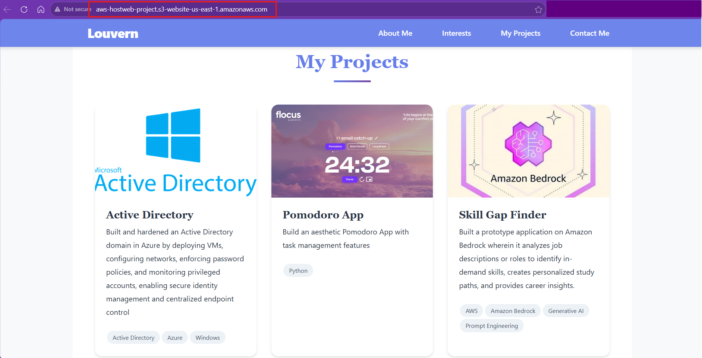


### 2. Bucket Policies
I also explored setting up a bucket policy.
On the Bucket, navigate to Permissions tab and under Bucket Policy, click Edit.
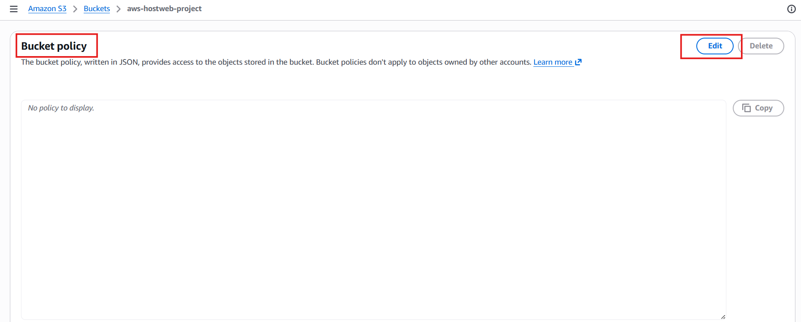

I pasted the sample snippet below on the type field:

Bucket Policy snippet:

``` JSON
{
"Version": "2012-10-17",
"Id": "BucketPolicy_Deny_Delete",
"Statement": [
	{
	"Sid": "BucketPutDelete",
	"Effect": "Deny",
	"Principal": "*",
	"Action": "s3:DeleteObject",
	"Resource": "arn:aws:s3:::<bucket-name>/<object-name>"
	}
  ]
}
```

Here’s a high‑level explanation of that bucket policy snippet:
The JSON policy is a set of rules that tell S3 what actions are allowed or denied.

Version: This just shows the format version AWS uses for policies.

`Id`: A label for the policy

`Sid`: A short name for the rule.

`Effect`: Here it says `"Deny"`, which means the action is blocked.

`Principal`: `"*"` means it applies to everyone (all users).

`Action`: `"s3:DeleteObject"` is the specific action being denied: deleting objects.

`Resource`: This points to the exact file in the bucket (in this case, `portfolio_website.html`).

Basically, this policy prevents anyone who accesses the website from deleting specified objects.
Bucket policies allows you to determine what actions are people are allowed or not to do to the objects inside the bucket

Click `Save changes`
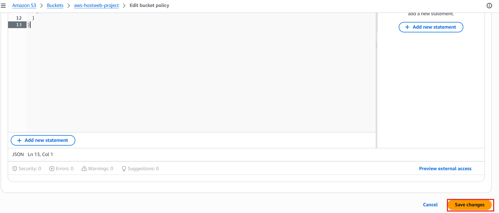

Go to objects tab and test deleting the portfolio_website.html
Type delete in the text input field to confirm deletion.
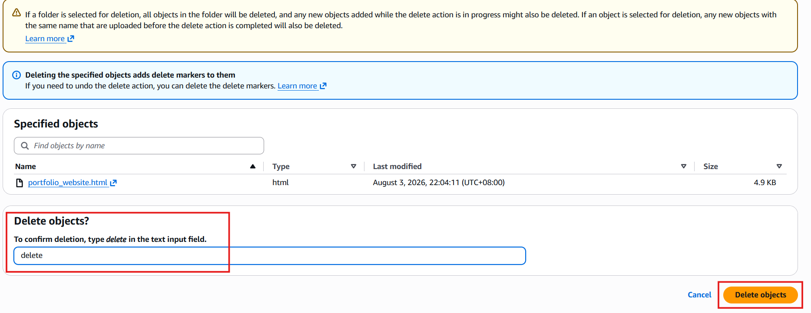

There is a warning that says failed to delete objects. `Error: Access Denied`
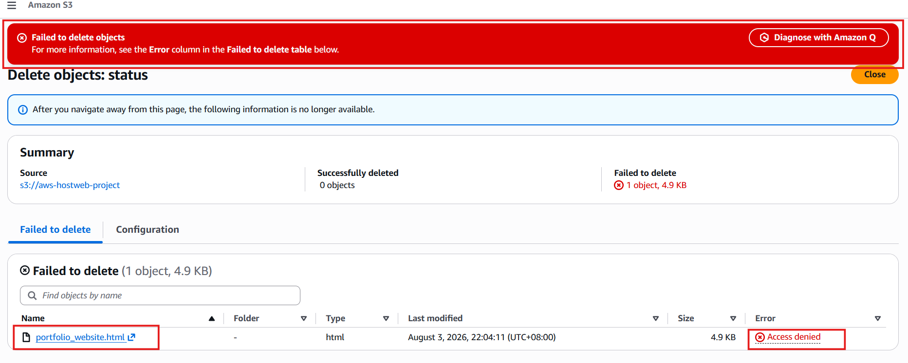

It means the bucket policy is working.

## Clean Up Resources
To avoid surprise costs for this project (because AWS bills are no joke), I cleaned up everything.
I deleted the bucket policy first to allow deletion of the files
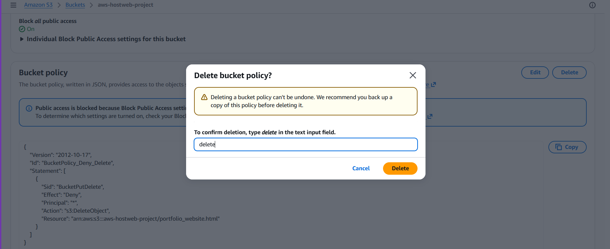

Then deleted the objects
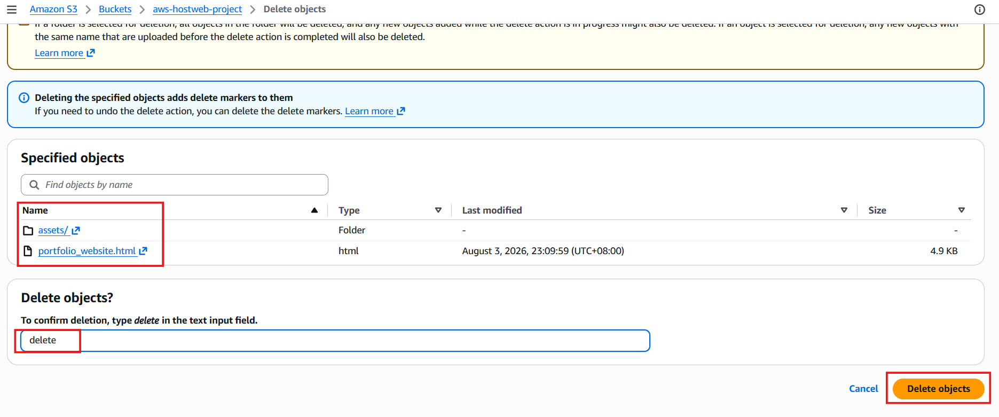

AWS won’t let you delete a bucket unless it’s empty first.
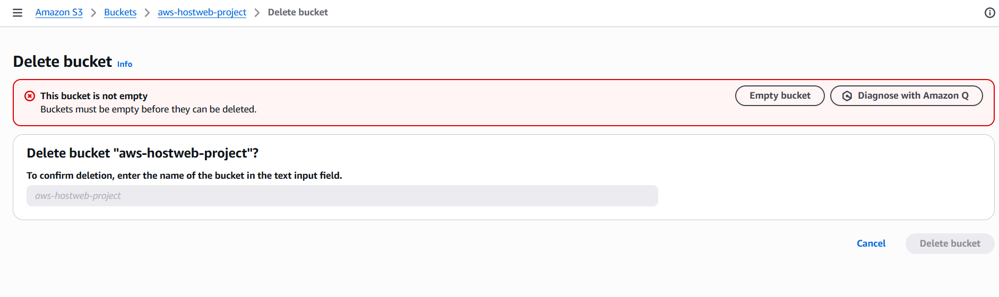
Emptying the bucket
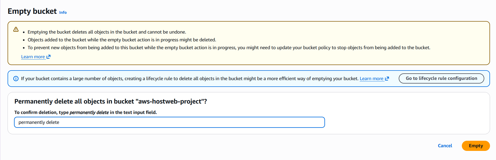
Then finally deleting the bucket.

## Key Services and Concepts Learned

Amazon S3 basics and bucket creation

ACLs for controlling file access

Bucket Policies for setting rules on what actions are allowed

Uploading and managing static files

Understanding bucket endpoint URLs

## What Can Be Improved
Next time, I’d like to automate uploads with the AWS CLI, use CloudFront for faster global delivery, and enable HTTPS with SSL certificates so the site is secure.

My definition of Amazon S3 from this project:
*Amazon S3 feels like a big online folder where I can store files, decide who can see them, and even turn those files into a website that anyone can visit.*

This is my first documented AWS project so suggestions, and constructive feedback are highly appreciated!

## Thanks for scrolling 💜
If you read this far, you deserve a cookie! 🍪

